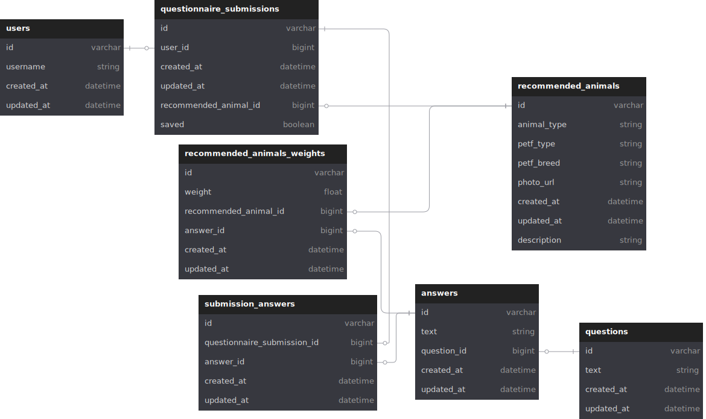

# Pet MatchMaker API

## Overview

Welcome to the backend repo for the Pet MatchMaker website! This repo holds the code responsible for running the database and exposing the API endpoints described in our [OpenAPI Documentation](https://pet-matchmaker-2412.github.io/pet_matchmaker_api_docs/).

### Notable Technologies

- Ruby
- Rails
- Postgres (PostgreSQL)
- RSpec
- factory_bot
- simplecov
- Faraday
- WebMock
- VCR

## Running Locally

### Requirements

- Ruby `3.2.2`
- bundler gem: `gem install bundler`
- [Postgres](https://www.postgresql.org/download/)

### Setup Steps

1. Clone the repo to your machine: `git clone https://github.com/Pet-MatchMaker-2412/pet_matchmaker_be.git`
2. Open the directory: `cd pet_matchmaker_be`
3. Install required gems: `bundler install`
4. Setup the database: `bundle exec rails db:{create,migrate,seed}`

### Populate Petfinder API Credentials

You will need to [get a set of credentials from the Petfinder API](https://www.petfinder.com/developers/signup/) to use in your local instance. Once you have your API key and secret, follow these steps to allow your local instance to use them:

1. Delete the current credentials file located at `config/credentials.yml.enc`: `rm config/credentials.yml.enc`
2. Open a new credentials file (if you don't use vscode, replace `code` with your preferred editor): `EDITOR="code --wait" rails credentials:edit`
3. Add a new top level entry for `petfinder` with two child objects under `key` and `secret`. Your file should look like this:

```yaml
secret_key_base: <RAILS_SECRET_KEY>

petfinder:
  key: <PETFINDER_API_KEY>
  secret: <PETFINDER_API_SECRET>
```

4. Save and close this file

Note: If you plan on working with other developers, you will need to securely share the contents of your `config/master.key` with them. **WARNING**: Anybody who has access to your `master.key` will then have access to your Petfinder API key and secret

### Running Test Suite

- To run the entire suite: `bundle exec rake`
- To run only the model tests: `bundle exec rspec spec/models`
- To run only the request tests: `bundle exec rspec spec/requests`

## Database Design

[](db/schema.rb)

## API Endpoints

To view the available endpoints for this API, please visit our [OpenAPI Documentation](https://pet-matchmaker-2412.github.io/pet_matchmaker_api_docs/). There you will find our endpoint definitions, required formatting for requests, example requests and responses (including JSON schemas), and the ability to try out requests on our deployed instance!

## Contributors

### Beverly Green

- [LinkedIn](https://www.linkedin.com/in/beverlylouisegreen/)
- [GitHub](https://github.com/bevgreen)

### Jaren Garman

- [LinkedIn](https://www.linkedin.com/in/jarengarman/)
- [GitHub](https://github.com/JarenGarman)

### Jonathan Atkins

- [LinkedIn](https://www.linkedin.com/in/jonathanjatkins/)
- [GitHub](https://github.com/Jonathan-Atkins)

### Logan Sauer

- [LinkedIn](https://www.linkedin.com/in/ldsauer/)
- [GitHub](https://github.com/ldsauer)

### Will Fox

- [LinkedIn](https://www.linkedin.com/in/williammacdonaldfox/)
- [GitHub](https://github.com/willfox0409)
